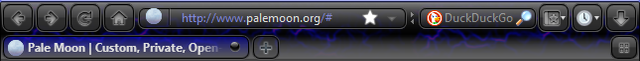

# LavaMoon Blue

LavaMoon Blue is a Pale Moon fork/adaptation based on the original LavaFox v2-Blue theme by Zigboom.

This fork/adaptation is developed and distributed with written permission from the original author.

The Pale Moon compatibility adaptation and related compatibility modifications were made by Halvar666.

## Status

This is the first stable Pale Moon release of LavaMoon Blue

## License

LavaMoon Blue remains subject to the same license and terms as the original LavaFox / LavaFox Blue theme unless otherwise stated by the original author.

The original license terms are included in `LICENSE.txt` and in the theme package as `READ ME  IMPORTANT.txt`.

## Credits

Original theme:

* Zigboom

Pale Moon compatibility adaptation:

* Halvar666

